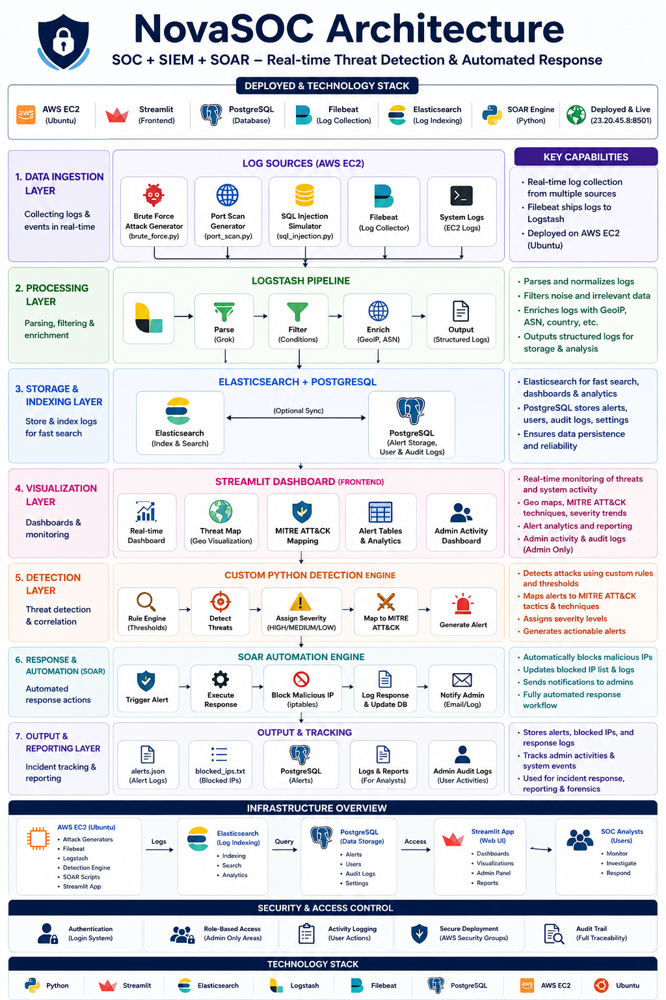
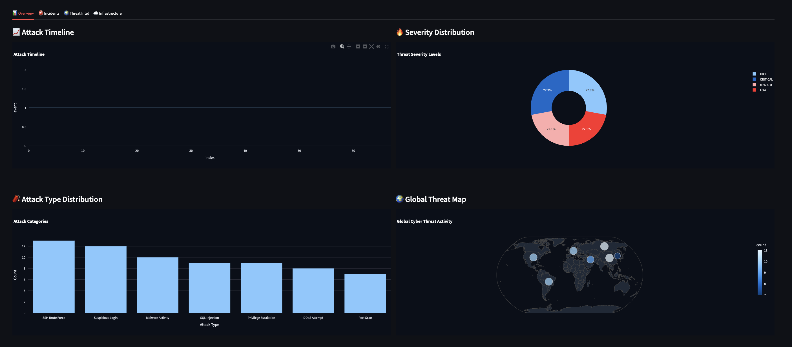
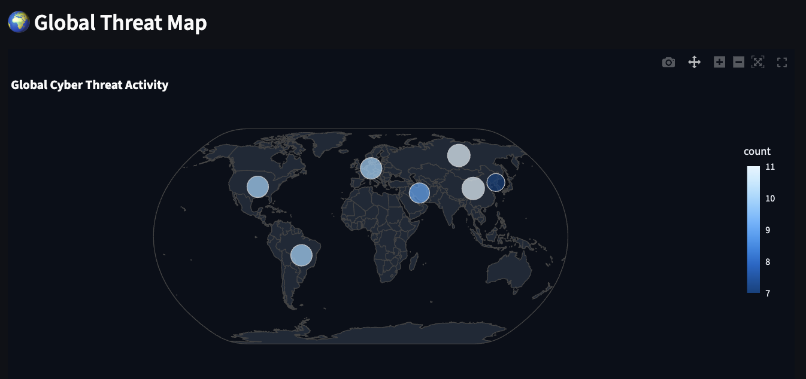
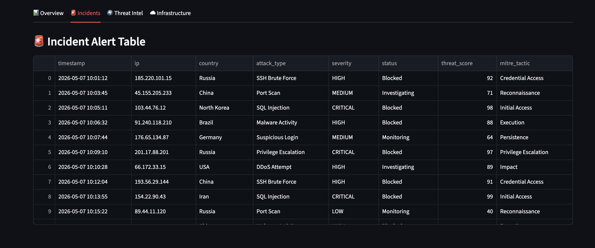
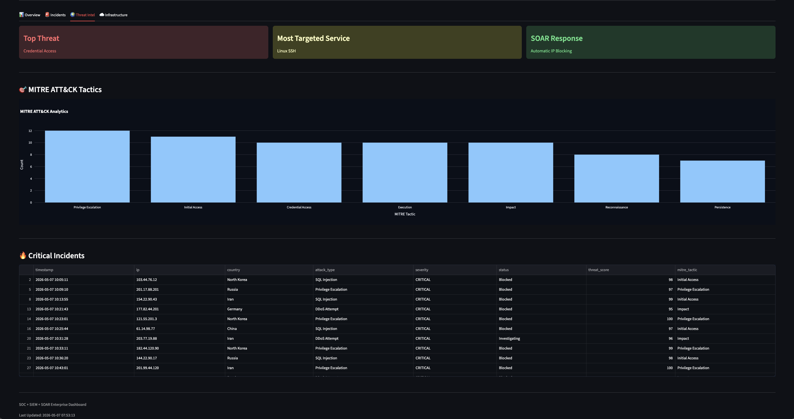
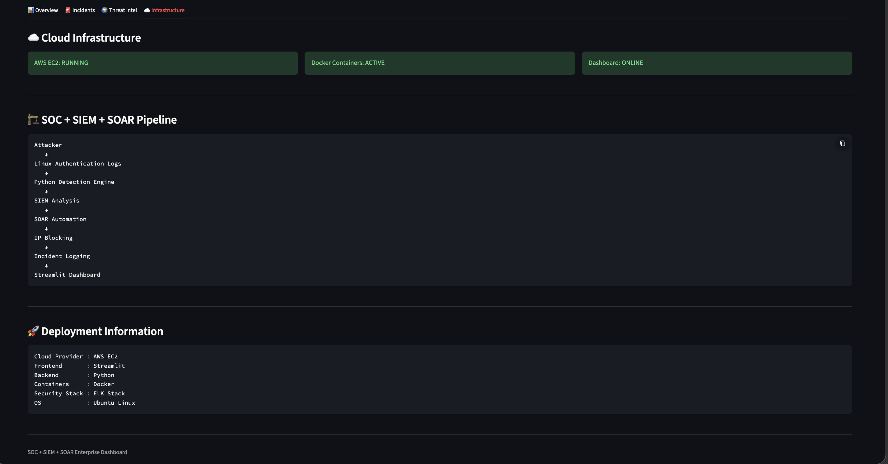
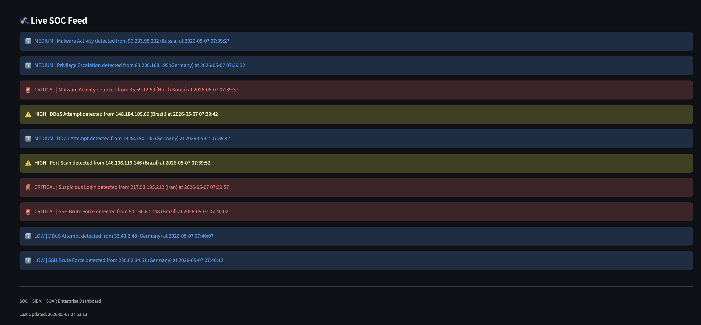

# 🔐 SOC + SIEM + SOAR Threat Detection & Automated Response System

## 🚀 Overview

This project is a complete enterprise-style cybersecurity platform that simulates a real-world:

- Security Operations Center (SOC)
- Security Information and Event Management (SIEM)
- Security Orchestration Automation and Response (SOAR)

system using:

- AWS cloud deployment
- ELK Stack
- Python automation
- enterprise dashboards
- real-time telemetry simulation
- automated incident response

The platform detects threats, visualizes cyberattacks, automatically responds to malicious activity, and displays enterprise-grade security analytics in a live dashboard.

---

## 🎥 Live Demo Video

Watch the full project walkthrough and live demonstration here:

👉 https://www.loom.com/share/2c5df19198724f3fbf375cb88da77521

The demo includes:

- architecture walkthrough
- real-time attack simulation
- live SOC telemetry
- SIEM analytics
- MITRE ATT&CK monitoring
- SOAR automation
- cloud deployment overview
- GitHub repository walkthrough

## ✅ Key Features

- ✅ Real-time threat detection
- ✅ Automated SOAR response
- ✅ Enterprise Streamlit dashboard
- ✅ Live SOC telemetry
- ✅ Global cyber threat map
- ✅ MITRE ATT&CK analytics
- ✅ Real-time incident feed
- ✅ Automated IP blocking
- ✅ Cloud deployment on AWS EC2
- ✅ Dockerized infrastructure
- ✅ Live attack simulation engine
- ✅ PostgreSQL telemetry integration
- ✅ Cloud-hosted live deployment
- ✅ Real-time database-backed analytics

---

## 🏗️ Architecture



```text
Attacker Activity
        ↓
Linux Authentication Logs
        ↓
Filebeat
        ↓
Logstash
        ↓
Elasticsearch
        ↓
Python Detection Engine
        ↓
SOAR Automation
        ↓
IP Blocking + Incident Logging
        ↓
Streamlit Enterprise Dashboard
```

---

## ⚙️ Technology Stack

| Category | Technology |
|---|---|
| Frontend | Streamlit |
| Visualization | Plotly |
| Backend | Python |
| Database | PostgreSQL |
| SIEM | ELK Stack |
| Cloud | AWS EC2 |
| Deployment | Render |
| Containers | Docker |
| Detection Engine | Python |
| Automation | Python SOAR Scripts |
| Threat Analytics | MITRE ATT&CK |
| Data Processing | Pandas |

---

# ☁️ Cloud Deployment

The platform is fully deployed on:

- AWS EC2 Ubuntu Server
- Dockerized Linux environment
- Public cloud-hosted dashboard

Deployment includes:

- real-time monitoring
- SOAR automation
- threat analytics
- enterprise security visualization
- live telemetry generation

---

## 🌐 Live Deployment

Live Dashboard:

👉 https://soc-siem-dashboard.onrender.com

The dashboard is publicly deployed and accessible through Render cloud hosting.

# 📊 Dashboard Features

## 🖥️ Overview Dashboard

- Total alerts
- Threat severity analytics
- Attack timelines
- Global threat map
- Attack distribution charts
- Country-based threat analytics



---

## 🌍 Global Threat Intelligence Map

Interactive cyber threat visualization displaying simulated attacks from countries worldwide.

Features:

- threat origins
- real-time attack visualization
- geopolitical threat simulation



---

## 🚨 Incident Management Dashboard

Enterprise-style incident management panel displaying:

- active alerts
- incident telemetry
- attack classifications
- blocked IP tracking
- severity analysis



---

## 🧠 Threat Intelligence Dashboard

MITRE ATT&CK analytics dashboard featuring:

- attack tactic distribution
- critical incident analysis
- threat intelligence insights
- targeted service monitoring



---

## 🏗️ Infrastructure Dashboard

Infrastructure monitoring panel displaying:

- AWS EC2 status
- Docker container health
- deployment telemetry
- SOC pipeline visualization



---

## ⚡ Live Attack Simulation

Custom-built telemetry engine continuously generates:

- fake cyberattacks
- simulated threat activity
- dynamic incident feeds
- realistic SOC telemetry

This creates:

- real-time dashboard updates
- realistic monitoring environments
- enterprise SOC simulation behavior



---

# 🚨 Detection Logic

The detection engine uses:

- threshold-based detection
- IP grouping
- time-window analysis
- severity scoring
- attack classification

Example detection rule:

- 20+ failed SSH logins
- within 5 minutes
- from the same IP

→ automatically triggers SOAR response

---

# ⚡ Automated SOAR Response

When attacks are detected:

- 🚫 malicious IPs are blocked
- 📝 incidents are logged
- 📊 dashboard updates automatically
- 🌍 threat map updates in real time
- 🔥 alerts appear in live SOC feed

---

# 🌍 Global Threat Simulation

The platform simulates realistic cyberattacks from:

- Russia
- China
- Iran
- North Korea
- Brazil
- Germany
- USA

Attack types include:

- SSH Brute Force
- SQL Injection
- Malware Activity
- DDoS Attempts
- Port Scanning
- Privilege Escalation
- Suspicious Login Activity

---

# 📁 Project Structure

```text
soc-siem-threat-detection/
├── config/
├── data/
│   ├── alerts.json
│   └── blocked_ips.txt
├── docs/
│   ├── architecture.png
│   ├── OverviewTab.png
│   ├── GlobalThreats.png
│   ├── IncidentsTab.png
│   ├── ThreatsTab.png
│   ├── InfastructureTab.png
│   └── LiveAttack.png
├── scripts/
│   ├── detect_bruteforce.py
│   ├── block_ip.py
│   └── auto_block.py
├── dashboard.py
├── db_writer.py
├── live_attack_generator.py
├── docker-compose.yml
└── README.md
```

---

# 🧪 How To Run

## 1. Clone Repository

```bash
git clone https://github.com/ayush-java/soc-siem-threat-detection.git
cd soc-siem-threat-detection
```

---

## 2. Create Virtual Environment

```bash
sudo apt install python3.14-venv -y
python3 -m venv venv
source venv/bin/activate
```

---

## 3. Install Dependencies

```bash
pip install -r requirements.txt
```

---

## 4. Start Dashboard

```bash
python3 -m streamlit run dashboard.py --server.port 8501 --server.address 0.0.0.0
```

---

## 5. Start Live Telemetry Pipeline

Open another terminal:

```bash
source venv/bin/activate
python3 live_attack_generator.py
```

Open another terminal:

```bash
source venv/bin/activate
python3 db_writer.py
```

This continuously generates simulated attacks and writes telemetry into PostgreSQL for real-time dashboard updates.
---

# 🎯 Learning Outcomes

This project demonstrates:

- SOC engineering
- SIEM architecture
- SOAR automation
- detection engineering
- threat intelligence
- MITRE ATT&CK analysis
- Docker containerization
- cloud deployment
- cybersecurity dashboard engineering
- security analytics
- real-time telemetry systems

---

# 📌 Future Improvements

Planned future upgrades:

- machine learning anomaly detection
- Slack/email alerting
- firewall API integration
- multi-cloud deployment
- threat intelligence API enrichment
- authentication system
- role-based access control
- database-backed telemetry storage

---

# 👤 Author

## Ayush Velhal

- Designed and implemented independently
- End-to-end architecture and development
- Cloud deployment and dashboard engineering
- Detection engineering and SOAR automation
- Frontend dashboard visualization and analytics

---

# ⭐ Final Note

This project simulates a modern enterprise cybersecurity monitoring environment by combining:

- cloud infrastructure
- SIEM pipelines
- automated SOAR response
- live telemetry
- global threat intelligence
- enterprise dashboards
- automated incident response

into a fully integrated real-time SOC platform.