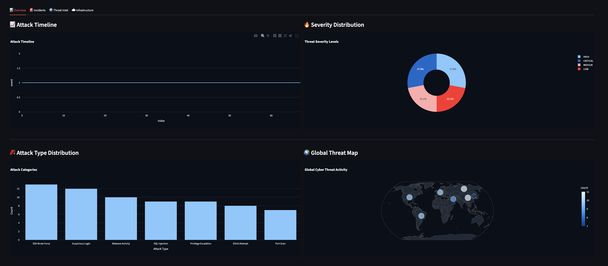
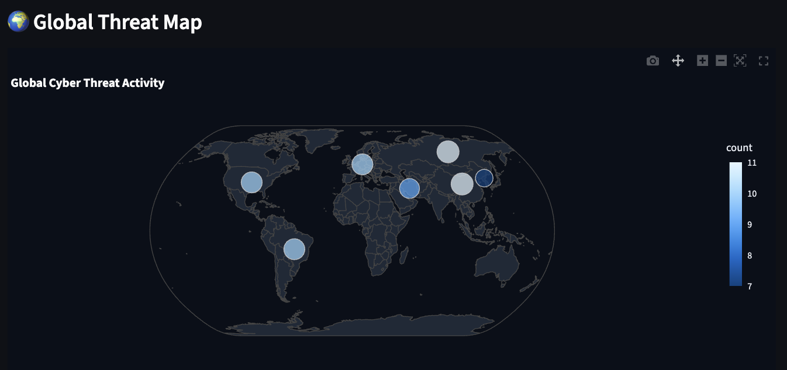
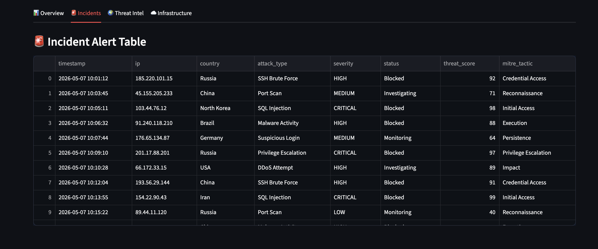
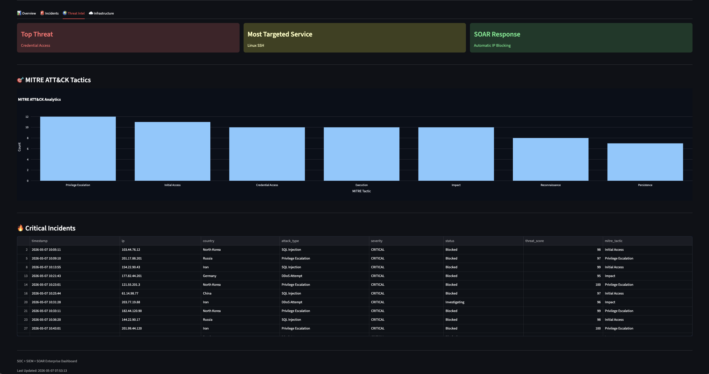
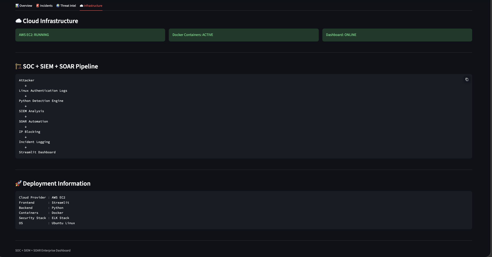
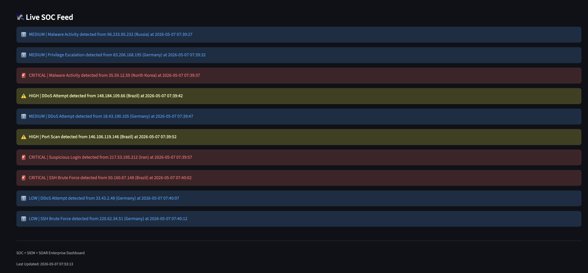

# 🔐 NovaSOC

## 🚀 Overview

NovaSOC is a cloud-hosted cybersecurity platform that simulates a real-world Security Operations Center (SOC), Security Information and Event Management (SIEM), and Security Orchestration Automation and Response (SOAR) environment.

The platform generates live cyberattack telemetry, performs automated threat detection, visualizes attack activity through enterprise dashboards, and executes simulated incident response workflows.

### Key Capabilities

* Real-time threat detection
* Automated SOAR response workflows
* Global cyber threat intelligence map
* MITRE ATT&CK analytics
* Incident management dashboard
* PostgreSQL-backed telemetry pipeline
* AWS cloud deployment
* ELK Stack integration
* Automated IP blocking simulation

---

## 🎥 Live Demo Video

👉 https://www.loom.com/share/8ba09c1b44544312844e2c3a4c1f96b5

---

## 🌐 Live Dashboard

👉 http://23.20.45.8:8501/

---

## 🏗️ Architecture

---

## ⚙️ Technology Stack

| Category         | Technology   |
| ---------------- | ------------ |
| Cloud            | AWS EC2      |
| Backend          | Python       |
| Database         | PostgreSQL   |
| SIEM             | ELK Stack    |
| Dashboard        | Streamlit    |
| Visualization    | Plotly       |
| Containers       | Docker       |
| Threat Analytics | MITRE ATT&CK |

---

# 📊 Dashboard Screenshots

## Overview Dashboard

## Global Threat Intelligence Map

## Incident Management

## Threat Intelligence

## Infrastructure Monitoring

## Live Attack Simulation

---

## 🚨 Simulated Threats

NovaSOC generates and analyzes realistic cyberattack activity including:

* SSH Brute Force
* SQL Injection
* DDoS Attacks
* Malware Activity
* Port Scanning
* Privilege Escalation
* Suspicious Login Activity

---

## 👤 Author

**Ayush Velhal**

Designed and developed independently, including cloud deployment, detection engineering, SIEM architecture, SOAR automation, dashboard development, and threat analytics.
